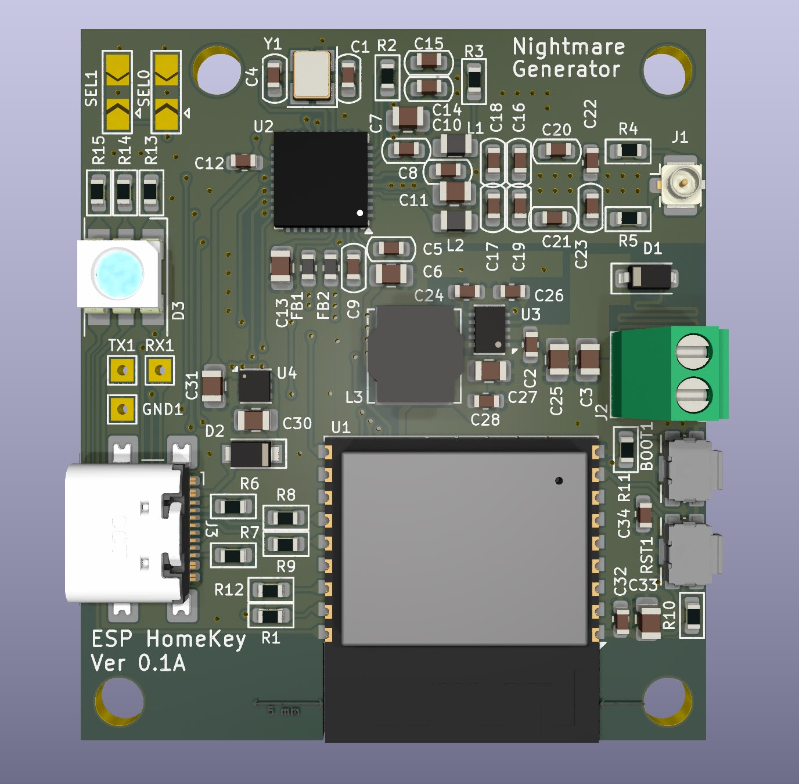

<div align="center">

# HomeKey-ESP32-PCB

**A miniaturized, wall-mountable HomeKey reader board**

A custom PCB implementation of [rednblkx/HomeKey-ESP32](https://github.com/rednblkx/HomeKey-ESP32) that brings Apple HomeKey NFC unlocking into a form factor small enough to hide behind your existing wall plate.

[](LICENSE)



</div>

## What is this?

This project is a **hardware redesign** of the excellent [HomeKey-ESP32](https://github.com/rednblkx/HomeKey-ESP32) firmware by [@rednblkx](https://github.com/rednblkx). Instead of using a separate development board wired to a breakout PN532 module, everything is integrated onto a single, compact PCB.

The board packs an **ESP32-C3** and an **NFC reader front-end with an on-board coaxial NFC antenna** into a footprint designed to fit inside a **European 503 (3-module) flush-mount wall box**. This lets you install a fully functional Apple HomeKey reader directly behind a standard wall plate — no external modules, no messy wiring.

## Key Highlights

- **All-in-one PCB** — ESP32-C3 + NFC front-end + coaxial antenna on a single board
- **Fits a European 503 plug slot** — designed for standard flush-mount wall boxes
- **Integrated coaxial NFC antenna** — tuned on-board antenna, no external coil needed
- **Runs the original HomeKey-ESP32 firmware** — full Apple HomeKey / HomeKit compatibility
- **Fully open hardware** — designed in **KiCad**, with schematics, layout, Gerbers and a 3D model included

## Get the Board

Don't want to fabricate it yourself? You can order the PCB directly from PCBWay:

**➡️ [ESP32 HomeKey on PCBWay](https://www.pcbway.com/project/shareproject/ESP32_Homekey_77a119d7.html)**

## Designed in KiCad

The entire board is designed with **[KiCad](https://www.kicad.org/)**, so the complete hardware source is open and editable. The repository includes:

- Hierarchical KiCad schematics (`Homekey.kicad_sch`, `ESP32.kicad_sch`, `NFC.kicad_sch`, `Power.kicad_sch`, `Square.kicad_sch`)
- KiCad PCB layout (`Homekey.kicad_pcb`) and project file (`Homekey.kicad_pro`)
- Exported schematic PDF (`Homekey.pdf`)
- Bill of Materials (`Homekey.xlsx`)
- A 3D model of the assembly (`Homekey 3D.step.zip`)

You can open the project directly in KiCad to review, modify, or re-fabricate the board.

## Repository Structure

```
HomeKey-ESP32-PCB/
├── Firmware/              # HomeKey-ESP32 firmware (based on the original repo)
├── Gerbers/               # Fabrication-ready Gerber files
├── ESP32.kicad_sch        # ESP32-C3 subsheet
├── NFC.kicad_sch          # NFC front-end + antenna subsheet
├── Power.kicad_sch        # Power supply subsheet
├── Square.kicad_sch       # Additional subsheet
├── Homekey.kicad_sch      # Top-level schematic
├── Homekey.kicad_pcb      # PCB layout
├── Homekey.kicad_pro      # KiCad project file
├── Homekey.pdf            # Schematic (PDF export)
├── Homekey.xlsx           # Bill of Materials
├── Homekey-job.gbrjob     # Gerber job file
├── Homekey 3D.step.zip    # 3D model of the board
├── Homekey-3D-render.png  # 3D render of the assembled board
└── README.md
```

## Getting Started

### 1. Get the Board

- **Buy it ready-made:** order the PCB directly from [PCBWay](https://www.pcbway.com/project/shareproject/ESP32_Homekey_77a119d7.html).
- **Fabricate it yourself:** use the ready-to-order files in the [`Gerbers`](Gerbers) folder with your preferred PCB fab house.
- Refer to `Homekey.xlsx` for the Bill of Materials and `Homekey.pdf` for the schematic.
- To modify the design first, open `Homekey.kicad_pro` in KiCad.

### 2. Flash the Firmware

The board runs the standard HomeKey-ESP32 firmware. The [`Firmware`](Firmware) folder contains a build based on the original repository.

```bash
# Install esptool (one-time setup)
pip install esptool

# Flash the firmware (replace YOUR_PORT)
esptool.py --port YOUR_PORT write_flash 0x0 firmware.factory.bin
```

> Prefer a GUI? Use the [browser-based flasher](https://espressif.github.io/esptool-js/) — no command line needed.

For firmware configuration, pairing, and usage, follow the official documentation:
- **Docs:** https://rednblkx.github.io/HomeKey-ESP32/
- **Upstream firmware:** https://github.com/rednblkx/HomeKey-ESP32

### 3. Install & Pair

1. Mount the board inside your 503 wall box behind the plate.
2. Connect to the device's setup WiFi AP and configure your WiFi + HomeKit setup code.
3. Pair with Apple Home and start unlocking with a tap of your iPhone or Apple Watch. 🎉

## Credits

- **[@rednblkx](https://github.com/rednblkx)** — creator of the original [HomeKey-ESP32](https://github.com/rednblkx/HomeKey-ESP32) firmware this board is built for
- **[@kormax](https://github.com/kormax)** — reverse-engineered the HomeKey NFC protocol
- **[@kupa22](https://github.com/kupa22)** — researched the HAP side of HomeKey

## License

This project is licensed under the **MIT License** — see the [LICENSE](LICENSE) file for details.

## Disclaimer

This project implements Apple HomeKey functionality through reverse engineering.

- **Not affiliated** with, nor condoned by, Apple Inc.
- **Use at your own risk** for security-critical applications.
- **Apple**, **iPhone**, and **Apple Watch** are trademarks of Apple Inc.
- **ESP32** is a trademark of Espressif Systems (Shanghai) Co., Ltd.
